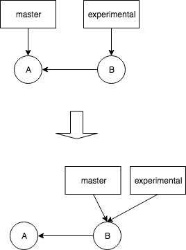

# Codelab: evident merge

We follow a similar setup from the branches codelab. Basically, we start a new branch (experimental) from the master (with commit A)
and make a change to it (commit B). Then, we will merge this change into the master branch.

As there are only changes in the experimental branch, git has not much to do: it only needs to move the pointer
of the branch.




## 1. Setup
Create back the inital structure from branching codelab:

*master*
```
|-- toys
    |-- furby.txt
    |-- .git  
```

Commit (A)

The commands are:
```
mkdir toys
cd toys
git init
touch furby.txt
git add furby.txt
git commit -m "A" 
```

*experimental*
Create a branch "experimental", switch to it, then add file `killerRobot.txt` again.
The difference with the branch-lab is that we make no additional commits to the master branch.

```
git checkout -b experimental
touch killerRobot.txt
git add killerRobot.txt
git commit -m "B" 
```

Show the setup:

```
$ git log --all --decorate --oneline --graph
* f5c37a1 (HEAD -> experimental) B
* e9dcd07 (master) A

```

## 2. Merge

Branch experimental has diverged from master. Take all additional changes from experimental into master:

git merge wil ALWAYS merge into the HEAD (= current) branch. So the first step is switching to the branch you
want to merge into. That is the master.

`git checkout master`

Now HEAD refers to `master`

then do the merge

`git merge experimental`

```
$ git merge experimental
Updating e9dcd07..f5c37a1
Fast-forward                                          <-- indicates this is only a pointer move
 killerRobot.txt | 0
 1 file changed, 0 insertions(+), 0 deletions(-)
 create mode 100644 killerRobot.txt

```
