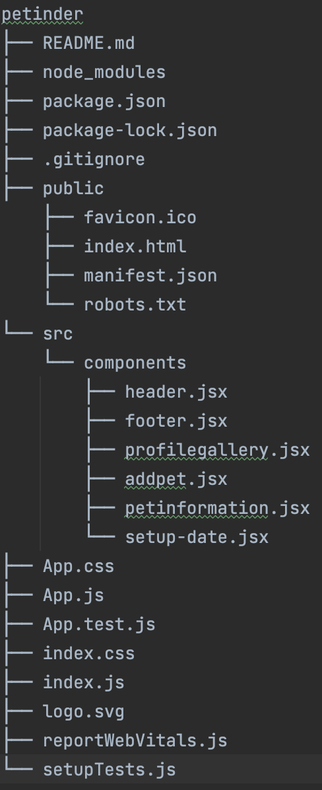

# Codelab01 - Let's fire up a ReactJS app

## First steps
Development in ReactJS differs quite a bit from development in Angular. React does not have an extensive CLI to work with. In fact the only thing we need 
to get a basic ReactJS app going, is our trusty old Node Packet Manager (NPM). You should have it installed by now, but for those who don't, you can find
it at [the Node.js website](https://nodejs.org/en/). We recommend installing the LTS version. Latest features can be exciting, but the LTS
build is stable and recommended for most users. Node includes npm (the node package manager) and npx (the node package runner).

Once you have installed Node, you are good to go! Open up git bash, navigate to the correct folder where you want to install your app into and type ``npx create-react-app petinder``. This will create a React app with the necessary
dependencies in a newly created folder called Petinder. Node will work its magic and boom... a wild React application will appear! Want to see what you got from this? Type 
npm start in your app's folder. It will make the application fire up and after a few seconds you will be able to see it working at [http://localhost:3000] (http://localhost:3000)!

## Understanding our application
It can be tempting to start right away, but this isn't always the best idea. Not just in React but in pretty much everything related to software development. Let's take a moment to think about what our app will look like. What it needs
to do and what it will consist of. We are going to make an app called Petinder. It's a Tinder service for pets (duh!). Take a look at our working version of this :moneybag: :moneybag: :moneybag: idea [here](https://petinder-react.netlify.app).

**Exercise**: Write down for yourself how you would chop up this application. Think in terms of components. Any part of the app can be a component and they can all be tied together at the end, showing a complete app. Once you're done with that, 
take a look below and see how we would approach it.


Let's analyze what we see here. At the very least, we have a header, a footer and content in between. Those are the three major building blocks.

* Header and footer: This seems pretty straightforward. Not much logic or responsibilities going on, so we can treat the two of them as two separate components, no need to divide them further.
* Content: This is a different case. There's a lot going on here. We need to show the pets we receive from our backend. On top of that, we need to provide several functionalities. Clients need to be able to search for a pet by its name. Clicking on a pet should
show the pet's profile information. We also want to grant them the possibility to add or delete a pet and, if the chemistry is real, they should be able to schedule a date with the corresponding pet. That's a lot of responsibilities and logic for one component. 
Heck, it's just too much for one component. Good thing React allows us to make components out of most of our requirements, allowing us to follow the single-responsibility principle and keeping our code as clean as possible.

So in conclusion: We will be creating the following components: 
* Header
* Footer
* Profile Gallery (the center showing our pets, our sorting and search function will be part of this as well since that's all tied to showing our list of pets)
* Add Pet
* Pet Information (Pet Information will include the delete pet button and the button to navigate towards the Setup Date component)
* Setup Date

In a project structure, it will look like this:



The **src** directory is where we'll spend most of our time, as it's where the source code for our application lives. In it you see a subfolder called **components**, this is the place where we will store our.... *drumroll*.... components!

The **public** directory contains files that will be read by your browser while you're developing the app; the most important of these is index.html. React injects your code into this file so that your browser can run it. There's some other markup that helps create-react-app function, so take care not to edit it unless you know what you're doing. You very much should change the text inside the <title> element in this file to reflect the title of your application. Accurate page titles are important for accessibility!

The public directory will also be published when you build and deploy a production version of your app. We won’t cover deployment in this tutorial, but you should be able to use a similar solution to that described in our Deploying our app tutorial.

The **package.json** file contains information about our project that Node.js/npm uses to keep it organized. This file is not unique to React applications; create-react-app merely populates it. You don't need to understand this file at all to complete this tutorial, however, if you'd like to learn more about it, you can read What is the file `package.json`? on NodeJS.org; we also talk about it in our Package management basics tutorial.

This is our interpretation of a good setup for this app. Other people might have a different view on this and their view might be equally viable, React doesn't provide too many conventions and/or guidelines to follow. This makes it difficult to know if you're
doing the right thing. You'll see that when you start looking up certain issues you run into. There's tons of information out there and everyone seems to have a different solution for the same problem. It's normal to feel a bit lost in this and it can get frustrating
at times. A good rule of thumb is following what you already know about coding. Try to stick to one responsibility per component. Keep code as concise and clear as possible, with the idea that another developer should be able to find his way quick in the codebase always on your mind.

You'll notice React uses often uses JSX (there are other types possible). Take a look at [https://reactjs.org/docs/introducing-jsx.html](https://reactjs.org/docs/introducing-jsx.html) to learn more about this syntax extension to JavaScript.

## Conclusion
We now have a working React application. We got rid of the default contents and replaced it with the title of the app we're going to build. For now, we only have one component in
this app, which consists of ``App.jsx``, containing the component's logic and template we will be showing in our browser.

You've learned:
- how to create a new React app with ```create-react-app```.
- how to start your angular app with ```npm start```.
- what JSX is and why React recommends you to use it.
- that a component contains both logic and its template within a single JSX file.
- to think about the structure of your app before diving into its code.


