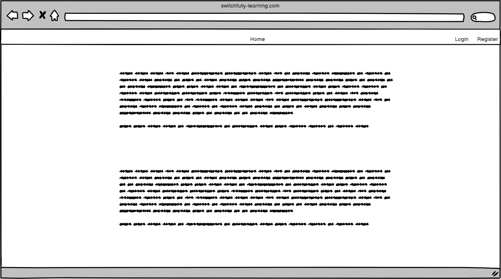

# Building a Learning Management System

## Stories

### HOM-1
**As a visitor I will see the home page when visiting the LMS application**
    
    When a visitor navigates to our application, he/she will see arrive at our home page first.
    The home page contains information on what the LMS system is about.

### ACC-1
**As a visitor I can register an account**

    When a student wants to use our LMS, he/she first needs to create an account.
    To create an account the visitor can go the register page using the navigation menu.
    After filling in the form the visitor is registered in the system.

#### Screen

#### Acceptance criteria

| Given                                                                           | When                         | Then                                                         |
|---------------------------------------------------------------------------------|------------------------------|--------------------------------------------------------------|
| As a visitor, I have filled in my username, email, password and repeat password | Clicking the register button | I am registered in the system                                |
| As a visitor I forget to fill in a field                                        | Clicking the register button | I get a message the the field is required                    |
| As a visitor I register with an already registered email address                | Clicking the register button | I get a message that the email address is already registered |

### ACC-2
**As a student I can log into my student account**

### ACC-3
**As a student I can view my profile**

### ACC-4
**As a student I can edit my profile**

### COA-1
**As a coach I can log into my account**

### CLA-1
**As a coach I can create a class**

### CLA-2
**As a student I can choose my class in my profile**

### CLA-3
**As a student/coach I can view the class overview screen**

### MOD-1
**As a coach I can create a module**

### MOD-2
**As a coach I can edit the name of a module**

### MOD-3
**As a student I can get an overview of all modules**

### SUB-1
**As a coach I can create a sub-module**

### SUB-2
**As a coach I can edit the name of a sub-module**

### SUB-3
**As a student I can get an overview of all sub-modules**

### COU-1
**As a coach I can create a course**

### COU-2
**As a coach I can edit the name of a course**

### COU-3
**As a student I get an overview of all courses in a modules**

### COD-1
**As a coach I can create a codelab**

### COD-2
**As a coach I edit a codelab**

### COD-3
**As a student I can get an overview of all codelabs in a course**

### PRO-1
**As a student I can mark my progress of a codelab**

### PRO-2
**As a student a course is marked as done if I have marked all codelabs of that course as done**

### PRO-3
**As a student a sub-module is marked as done if I have marked all courses of that sub-module as done**

### PRO-4
**As a student a module is marked as done if I have marked all sub-modules of that module as done**

### CDD-1
**As a student I can go to the detail of a codelab**

### CDD-2
**As a student I can add a personal comment to the detail of a codelab**
