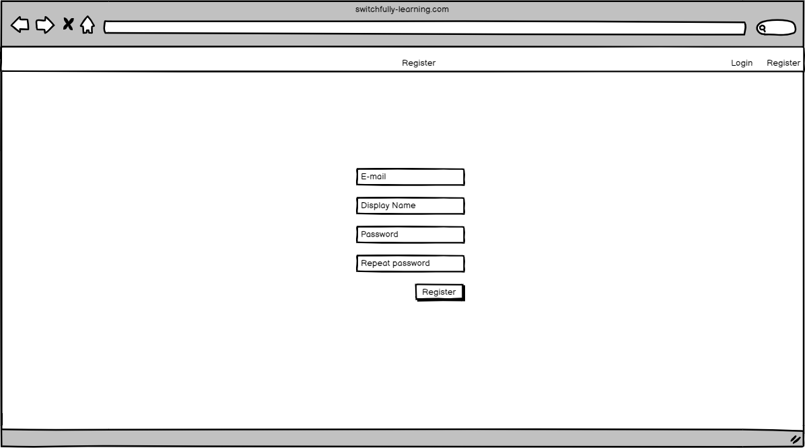
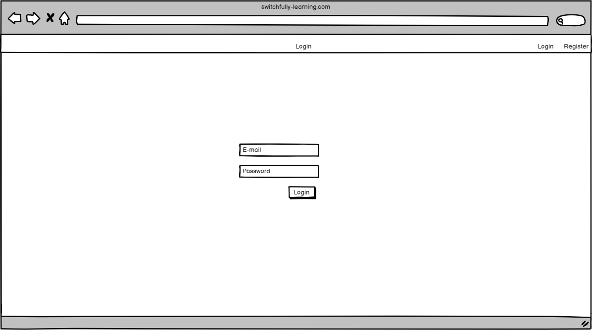
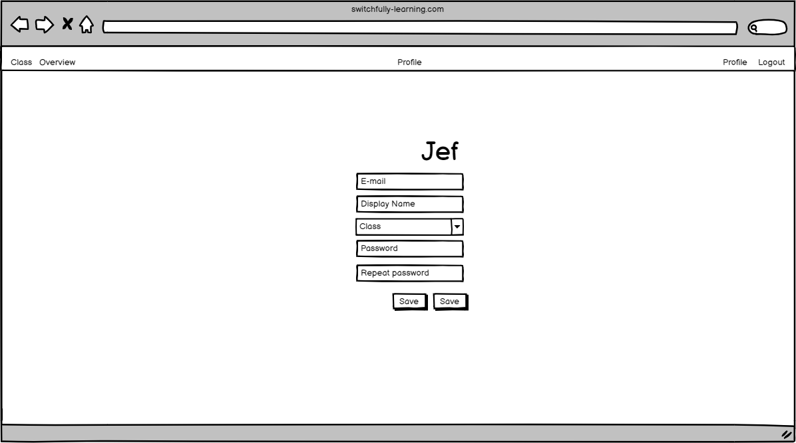

# Building a Learning Management System

## Stories

### HOM-1

**As a visitor I will see the home page when visiting the LMS application**

    When a visitor navigates to our application, he/she will see arrive at our home page first.
    The home page contains information on what the LMS system is about.

### ACC-1

**As a visitor I can register an account**

    When a student wants to use our LMS, he/she first needs to create an account.
    To create an account the visitor can go the register page using the navigation bar.
    After filling in the form the visitor is registered in the system.

#### Screen

#### Acceptance criteria

| Given                                                                                | When                         | Then                                                         |
|--------------------------------------------------------------------------------------|------------------------------|--------------------------------------------------------------|
| As a visitor, I have filled in my: display name, email, password and repeat password | Clicking the register button | I can log into my account                                    |
| As a visitor I forget to fill in a field                                             | Clicking the register button | I get a message the the field is required                    |
| As a visitor I register with an already registered email address                     | Clicking the register button | I get a message that the email address is already registered |
| As a visitor I fill in two different passwords                                       | Clicking the register button | I get a message that the password do not match               |

### ACC-2

**As a student I can log into my student account**

    When a student wants to login, he/she first need to navigate to the login page.
    On the login page the visitor can enter his/her credentials.
    When pressing the login button, if the credentials are correct, the student is logged in.
    The student will then be navigated to their profile page and their name will appear in the navigation bar as: 'logged in as student <student_name>'

#### Screen

| Given                                 | When                                                                                   | Then                                                                                                                   |
|---------------------------------------|----------------------------------------------------------------------------------------|------------------------------------------------------------------------------------------------------------------------|
| A student with an existing account    | Going to the login page Filling in their credentials Pressing the login button | Student will be navigated to their profile page The message 'Logged in as student <student_name>' will be visible. |
| A student with a non-existing account | Going to the login page Filling in their credentials Pressing the login button | A warning message will appear: 'Invalid credentials'                                                                   |
| A student with a existing account     | Going to the login page Filling in the wrong password                              | A warning message will appear: 'Invalid credentials'                                                                   |

### ACC-3

**As a student I can view my profile**

    Every student has a profile page. In here a student can view his/her profile.
    In the profile page you can view your: username and display name.

#### Screen

| Given                             | When                                                      | Then                                                                                |
|-----------------------------------|-----------------------------------------------------------|-------------------------------------------------------------------------------------|
| A student logs into their account | Login successful                                          | The student is navigated to their profile page, viewing their name and display name |
| A student is logged in            | Navigating to their profile page using the navigation bar | The student is navigated to their profile page, viewing their name and display name |

### ACC-4

**As a student I can edit my profile**

    Every student has a profile page. In here a student can change his/her profile.
    In the edit profile page you can change your: username, display name and password.

#### Screen

| Given                                   | When                                                                        | Then                                                                                                      |
|-----------------------------------------|-----------------------------------------------------------------------------|-----------------------------------------------------------------------------------------------------------|
| A student is on their profile page      | When clicking the 'edit' button                                             | The student is navigated to the edit profile page                                                         |
| A student is on their edit profile page | Changing either their display name, email or password and pressing 'save'   | The respective properties will have changed The student will be navigated back to their profile page. |
| A student is on their edit profile page | Changing either their display name, email or password and pressing 'cancel' | Nothing will have changed The student will be navigated back to their profile page.                   |
| A student is on their edit profile page | Changing their email to an already existing email and pressing 'save'       | The student will get a warning message: 'email already exists'                                            |
| A student is on their edit profile page | Changing their password but passwords do not match                          | The student will get a warning message: 'passwords do not match'                                          |

### COA-1

**As a coach I can log into my account**

### CLA-1

**As a coach I can create a class**

### CLA-2

**As a student I can choose my class in my profile**

### CLA-3

**As a student/coach I can view the class overview screen**

### MOD-1

**As a coach I can create a module**

### MOD-2

**As a coach I can edit the name of a module**

### MOD-3

**As a student I can get an overview of all modules**

### SUB-1

**As a coach I can create a sub-module**

### SUB-2

**As a coach I can edit the name of a sub-module**

### SUB-3

**As a student I can get an overview of all sub-modules**

### COU-1

**As a coach I can create a course**

### COU-2

**As a coach I can edit the name of a course**

### COU-3

**As a student I get an overview of all courses in a modules**

### COD-1

**As a coach I can create a codelab**

### COD-2

**As a coach I edit a codelab**

### COD-3

**As a student I can get an overview of all codelabs in a course**

### PRO-1

**As a student I can mark my progress of a codelab**

### PRO-2

**As a student a course is marked as done if I have marked all codelabs of that course as done**

### PRO-3

**As a student a sub-module is marked as done if I have marked all courses of that sub-module as done**

### PRO-4

**As a student a module is marked as done if I have marked all sub-modules of that module as done**

### CDD-1

**As a student I can go to the detail of a codelab**

### CDD-2

**As a student I can add a personal comment to the detail of a codelab**
